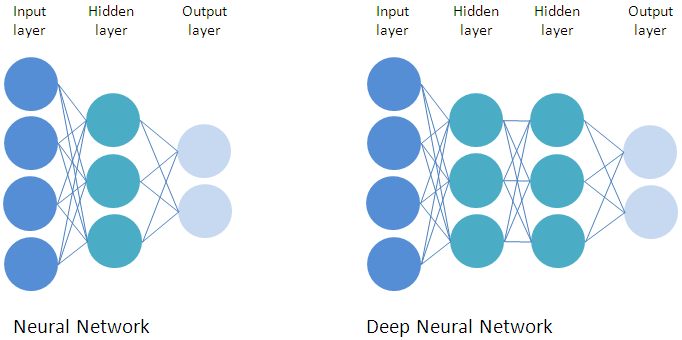
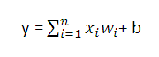
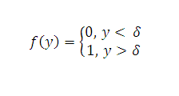
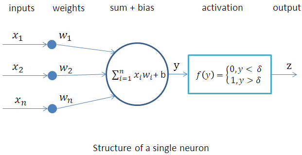
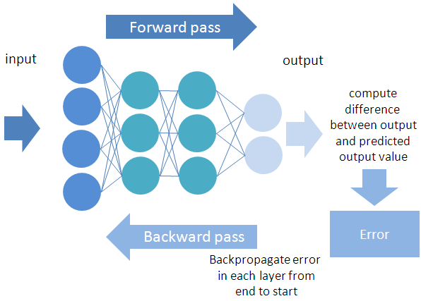

# Pytorch tutorial for beginners

Nowadays, Artificial Intelligence is everywhere. We can find it in tools that we use in our daily existence. From electronic games, 
online commercial services, medical diagnosis to autonomous cars, Artificial Intelligence is here for improving our life.

Artificial Intelligence is a very wide and complex area. It is so difficult to give an exact definition but we can define it as a science 
of computer which uses other sciences: mathematics (statistics, probability…) and human sciences (linguistic, cognitive…). 
The main target of Artificial Intelligence is to solve problem in the same way that human would do.      

How about getting started? Well, this is precisely the purpose of this tutorial. Firstly, we will introduce the deep learning concepts 
and last, we will learn how to use PyTorch one of the most powerful deep learning library. However, to take this tutorial you will need 
some knowledge: you need to have a basic familiarity with the Python programming language and a minimum of mathematics, especially 
as we will not go into details. 

## Deep learning! What is this?

Deep learning is a part of machine learning methods based on artificial neural networks. They are inspired by information processing and 
distributed communication nodes that we know in biological neural networks. 
Machine learning is a part of Artificial Intelligence that provides to a system the ability to learn from itself without being programmed explicitly. 
The neural network is a group of neurons organized in layers. The typical architecture of a neural network consists of input layer, hidden layer 
and output layer.

The input layer takes vector containing all the information of one data feature. The hidden layer is used for processing and forwarding the input data. 
The output layer outputs the final result. 
A network could have different numbers of hidden layers and number of neurons in each layer. The use of multiple hidden layers in the neural network 
is called deep neural network.

<div align="center">
  
</div>

The neuron (a.k.a perceptron) is the main element which composed a layer in artificial neural network. It is a processing unit which produces output 
signal from inputs signal. 

The inputs are the vector x = [x1,x2,x3,…xn] where n stands for the number of inputs.

Each input is multiplied by a corresponding weight in the vector w = [w1,w2,w3,…,wn]. The weight is used to find the best prediction for the given input x.

Overall sum is generated and a bias value (b) is added to it:

<div align="center">
  
</div>

Then this result is inputted into activation function f. It checks if the input is below or above a certain threshold δ therefore the output is respectively 0 or 1.

<div align="center">
  
</div>

There are a few examples of activation functions: ReLU (Rectified Linear Unit), Sigmoid, Hyperbolic tangent...

<div align="center">
  
</div>

Deep learning has multiple applications such as: self-driving car, image recognition, language translation, medical image analysis…

##How the neural network learns?

###Forward pass

In this step, activations are calculated at every layer (sum + bias and activation) as described above. These activations flow in the forward direction from 
the input layer to the output layer in order to generate the final output. This process is called forward pass or the propagation of information. 

###Cost function

The cost function or loss function is used to calculate the prediction error after the forward pass step. The choice of this function depends on the type of 
problem being treated. Once the computation of loss is complete, the neural network corrects the weights to minimize error as much as possible via a 
process called back-propagation.

###Backward pass

The backward pass or back-propagation is a step that happens after the forward pass. It is used to compute the gradient in different layers of the network. 
It is important to note that only the information from the loss function, not the information from the input, flows backward in the whole network. Once the gradient 
of the loss function is established then the weights of each neuron can be updated. The value of the updated weights is controlled by a parameter called learning rate. 
The training of a neural network is the basic part in the deep learning procedure. The learning process uses optimizer which aims to decrease the value of the loss function. 

<div align="center">
  
</div>

###Optimization algorithms 

The aim of training a neural network model is to reduce the value of the loss function. The optimization algorithms are used to update the value of the model parameters 
and then to decrease the value of the loss function. There are many optimization algorithms such as Stochastic Gradient Descent (SGD), Adam (Adaptive Moment Estimation)...

###Overfitting problem

Overfitting occurs when the training error is low but the validation error is significantly higher. Thus, the model can only predict the training data well but is not able to predict new unseen data.
Dropout is a technique to deal with the overfitting problem. Dropout technique is considered as a way to drop out neurons in a hidden layer. Dropping neural neurons out indicates temporarily 
removing the neurons and their corresponding incoming and outgoing connections in the neural network.

##Neural Network architectures

In this section, we will present a brief overview of the most common neural network architectures.

###Recurrent Neural Network

Recurrent Neural Network (RNN) is a type of deep neural network. RNN model is good at processing sequence data such as text or sequences. RNN model can be categorized into four different 
types. There are one-to-one RNN model, one-to-many RNN model, many-to-one RNN model, and many to-many RNN model.  These models are designed to deal with corresponding specific tasks.

RNN processes one by one the elements of a sequence and recurrently applies certain tasks to each element whose computation is depending on the previous computation(s). The model keeps 
memory of the previous elements.

However, RNN has the vanishing/exploding gradient problem. When training the network, the gradient values are used for updating the weights of the neural network. It may cause either very small 
weights or very large weights which will respectively cause the vanishing or exploding gradient problem. To solve that, a well-known variant of RNN was proposed:  the Long Short Term Memory (LSTM). 

###Convolutional Neural Network

Convolutional Neural Network (CNN) is another type of neural network which is inspired by the human visual nervous system. CNN model consists of convolutional layer, hidden layer, pooling layer 
and fully connected layer. It is usually applied in image classification and recognition.

For a good understanding of RNN and CNN, it is strongly recommended to check up other tutorials especially focused on them.

##Data

Dataset is required for training deep learning model.  60% of the original dataset must be used to train the model (training dataset), while 20% are used for validation (validation dataset). 
This dataset does not contribute to the weights updating contrary to the training dataset which is intended to find the right weights. It is used to check if overfitting happens. The remaining 20% 
of the original dataset are used for test dataset. We use it after the model finishes training. This dataset is used to test the accuracy of the network.

It is obviously necessary to have good training dataset which often requires filtering and redundancy cleaning.

The data used for feeding deep learning system comes from anywhere. It may be extracted from companies’s databases or all kinds of various sources: 
connected objects, smartphone, open data…. On the images side, there is for example ImageNet. In language, there is WordNet and MNIST (handwriting).

##Types of learning

Learning is the most important task in deep learning. There are three main types of learning: supervised learning, unsupervised learning and semi-supervised learning. They differ in 
their approach and can be used depending on the problem to solve. 

Supervised learning uses labeled dataset, the system observes the input - label pair and tries to find a mapping function between the pair.
Unsupervised learning system learns without labeled input. No labels are given to the learning algorithm.
Semi-supervised learning uses small amount of labeled data with a large amount of unlabeled data. 

##Hardware

Training the neural network must be done on a computer with particular specifications. The given training times for the neural network are referring to the set of hardware. Other hardware 
configurations will obviously train the same neural network, with the same dataset, faster or slower depending on the performance. The most influential hardware part regarding the 
training time is the Graphical Processor Unit (GPU). 

##What is PyTorch?

PyTorch is an open source machine learning framework that is based on Python and used for applications such as computer vision, natural language processing… It is developed and 
maintained by Facebook. Through using this framework, the difficulty of implementing a neural network is decreased. It contains common deep learning modules and many sub-libraries 
were developed for different tasks. 

In this tutorial, we will use PyTorch for text classification task in using RNN. The text classification problem is an example of supervised learning and a Natural Language Processing task.

The Natural Language Processing (NLP) is a field of artificial intelligence that aims to give machines the ability to understand and generate natural language text. NLP aims 
to develop methods for solving practical problems involving language, such as information extraction, machine translation, question answering...

For this NLP application, we will use the TorchText library. 

##Setting up the environment

Before we get stated, check if your hardware can handle PyTorch. Below is my hardware configuration. You can consider it as a minimum requirement and take it as a reference.
OS: Windows7
CPU: Pentium (R) Dual Core CPU E5800 @ 3.20 GHz
RAM: 4GB
GPU: None

Now, we have to install all the necessary programs and libraries. To install PyTorch, you have to install Python first. It is recommended that you download and install the latest version 
of Python. Then you will need to install numpy, PyTorch and TorchText. They could all be installed through pip.

Numpy installation will be done with the help of the pip install numpy command. Open your command prompt and type:

pip install numpy

Now, you have to see installation instructions on the PyTorch website https://pytorch.org/ to get the installation command of PyTorch. Here, you have to select your preferred 
PyTorch build, operating system, package, language, and CUDA. 

For my part, I have:
pip install torch==1.4.0+cpu torchvision==0.5.0+cpu -f  https://download.pytorch.org/whl/torch_stable.html

Next step is to install torchtext with the help of pip install torchtext command.

pip install torchtext

For those who wish it, below is the list of program and libraries that I am using in this tutorial.  		
- python-3.6.2
- numpy-1.18.1		
- pytorch-1.4.0
- torchtext-0.5.0	

When we have installed PyTorch, check if it runs successfully or not. Run python command to work with Python. Import torch to work with PyTorch and try this operation:

```python
import torch

#create tensor from list
x = torch.FloatTensor([[0,1,2], [3,4,5]])
print(x)
tensor([[0., 1., 2.],
        [3., 4., 5.]])
```

Another alternative for installing PyTorch is to use Conda.

##Application

Tensors are the base data structures of PyTorch which are used for building different types of neural network. They can be considered as multi-dimensional matrices 
that contain elements of a single data type. 

In this tutorial, our target is to build a simple neural network in PyTorch and train it to predict if a text is positive or negative. 

We use the quora questions dataset - which is a csv file - to train the network. We split the dataset with a ratio of 0.60 (train), 0.20 (validation) and 0.20 (test). Every 
text in the dataset has a label indicating to which category it belongs (0: positive and 1: negative). 

Now, we have to import all the necessary libraries required to build our model. Here is a brief overview of the packages/libraries we are going to use:
- The torch package is used for mathematical operations on multi-dimensional tensors.
- TorchText is a NLP library. It contains scripts for preprocessing text.

###How to manipulate data and pass it to the neural network inputs?

Deep learning models do not work with the text directly. The texts need to be transformed into a representation that is suitable for processing by the model.
Before you start training our model, we have to:
- Tokenize the text
- Load the data
- Map each word to unique integer
- Pad the text so that all the sequences have the same length, so we can process them in batch

Fortunately, we have TorchText for making all the above processing much easier.

Here, we will not give a detailed explanation of object's arguments that we will use. Feel free to find more information on the online official documentation at: https://pytorch.org/text/ 

Let us see how to preprocess text using Field object. It is used to specify preprocessing steps for each column in the dataset. Field has different arguments such as:
- sequential: if the datatype represents sequential data 
- tokenize: break sentence into list of words
- lower: convert word to lowercase

```python
import torch
from torchtext.data import Field

#tokenizer function
tokenizer = lambda x: x.split()

a = "Hello Word!"
tokenizer(a) = ['Hello','World!']		

#define fields
TEXT = Field(sequential = True, tokenize = tokenizer, lower = True)
LABEL = Field(sequential = False, use_vocab = False, dtype = torch.float)
```

As the label is numerical, we use use_vocab = False.

Next, we need to tell the fields what data in our datasets it should work on. We are going to create a list of tuples where first value in every tuple is a column name and second 
value is a field object defined above.  The fields we pass in must be in the same order as the columns in the csv file. Here, we have only two columns: question_text and label.

```python
fields = [("question_text", TEXT),("label", LABEL)]
```

In the following code, we load the training dataset in using the TabularDataset object which is convenient for csv file. We have to define the field objects. 
The same code will be used for validation and test dataset.

```python
from torchtext.data import TabularDataset

train_data = TabularDataset(path = 'train.csv',format = 'csv',fields = fields,skip_header = True)
```

The next step is to build the vocabulary. It consists of mapping words to integers. To each unique word is assigned an index. We apply build_vocab to the training data to generate a vocabulary list.

```python
TEXT.build_vocab(train_data)
```

Note that if a GPU is available, you can set the device to GPU otherwise you can leave it to CPU. 

```python
device = torch.device('cuda' if torch.cuda.is_available() else 'cpu')
```

We will use this device variable later in our code.

Now we can start the batching process for training the model. The Iterator object forms the batches. The BucketIterator object automatically shuffles and pads the input sequences to be on the same length.
Below is the code which initializes the Iterator for the train, validation and test data.	

```python
from torchtext.data import BucketIterator

train_iterator, valid_iterator = BucketIterator.splits(
    (train_data, valid_data, test_data), 
batch_size = BATCH_SIZE, sort_key = lambda x: len(x.question_text),
    sort_within_batch = True, device = device)
```

There is no standard value for the batch size but this is generally: 8, 16, 32, 64…

###Define the model

It is now time to define the architecture of our model. The base class for all neural network models is torch.nn.Module. This means that every model must be a subclass of the nn module.

```python
import torch.nn as nn

class Model(nn.Module):
	def __init__(self):	
	super().__init__()
	…
	def forward(self, x):
	…
```

We have defined two fundamental functions here:  __init__() and forward().

__init__(): is a constructor. The arguments passed to the class are initialized by it. We will define all the layers that we will use in the model.
Let us understand in detail about the different layers used for building the architecture and their parameters.
- Embedding layer: it is extremely important for any NLP task. It converts word indexes to word vectors.
	
	```python
	nn.Embedding(input_dim, embedding_dim)
	```	
	
	Here are the two most important parameters of the embedding layer:
	input_dim: size of the vocabulary
	embedding_dim:  number of dimensions for representing a word. This is usually around 50 to 250 dimensions.
- RNN: 
	
	```python
	nn.RNN(input_dim, hidden_dim)
	```
	
	The two important parameters are:
	input_dim: number of features in the input (=embedding_dim)
	hidden_dim: number of features in the hidden state             
- Linear Layer: it applies a linear transformation to the incoming input.
	
	```python
	nn.Linear(input_dim, output_dim)
	```
	
	The two important parameters are described below:
	input_dim: number of input features (=hidden_dim)
	output_dim: number of output features

forward(): it defines the forward pass of the inputs.
The input of the model is a batch. In this example, a batch can be represented like that:

[torchtext.data.batch.Batch of size 64]
	[.question_text]:[torch.LongTensor of size 14x64]
	[.label]:[torch.FloatTensor of size 64]

The input batch is a tensor of size [sentence_length, batch_size] and then passed through the embedding layer which gives a dense vector 
representation of our sentences.
The result is a tensor of size [sentence_length, batch_size, embedding_dim] and then passed into the RNN layer. After that, we get 2 tensors, 
one of size [sentence_length, batch_size, hidden_dim] and another of size [1, batch_size, hidden_dim] which is the final hidden state.
We use this final hidden state to feed the linear layer to produce a prediction.

Here is the process which happens in the forward() method.

To compute the gradient, we will use the optimization algorithm Adam that we can find in the torch.optim package. You have to give it the 
parameters to optimize and options that are specific to an optimizer such as the learning rate.

Let us initialize the model and the optimizer:

```python
import torch.optim as optim

# instantiate the model with hyper-parameters
model = Model(INPUT_DIM, EMBEDDING_DIM, HIDDEN_DIM, OUTPUT_DIM)
optimizer = optim.Adam(model.parameters(), lr=LEARNING_RATE)
```

To compute the loss we will use BCEWithLogitsLoss.

```python
criterion = nn. BCEWithLogitsLoss()
```

If you are using a GPU for training, you should have sent the model to the GPU.

```python
model.to(device)
```

###Training and evaluation

Now we will code our training loop. 
model.train() is used to put the model in training mode. We have to iterate over all training data once per epoch and load individual batch. 
We need to set the gradients to zero using optimizer.zero_grad(). Then we produce the output and compute the loss between this output and the truth label. 
Once the gradients are computed, the backward() method is called and the optimizer implements the step() method to update the parameters. 

```python
def train(model, iterator, optimizer, criterion):		
    
   model.train()
    	
    for batch in iterator:

        optimizer.zero_grad()

        predictions = model(batch.question_text).squeeze(1)
        
        loss = criterion(predictions, batch.label)
        
        loss.backward()
        
        optimizer.step()
        …		        
```

Evaluate is similar to train, with a few modifications as we don't update the parameters when evaluating.  model.eval() puts the model in evaluation mode 
and the use of torch.no_grad() specifies that no gradients are computed.

```python
def evaluate(model, iterator, criterion):

	model.eval()
	
	with torch.no_grad():
  	
	for batch in iterator:
		
		predictions = model(batch.question_text).squeeze(1)
        
		loss = criterion(predictions, batch.label)
		…
```

We will measure the accuracy of the model, so you need to get the index of the predicted value and the index of the correct value, check if they are equal 
and calculate the mean to all the dataset.

```python
def get_accuracy(pred, y):
    pred = torch.round(torch.sigmoid(pred))	
    correct = (pred == y).float()
    accuracy = sum(correct) / len(correct)
    return accuracy
```

Neural network model can be saved using:

```python
torch.save(model.state_dict(), 'model.pt')
```

It can be also loaded with: 

```python
model.load_state_dict(torch.load('model.pt'))
```

Note that one epoch equals to one forward pass and one backward pass of all the training examples. When these steps are executed for a 
number of epochs with a large number of training examples, the loss is reduced to a minimum value. The final weight is obtained which can 
be used to make prediction.

We are now ready to train the model. All the required steps have been established: forward propagation, loss computation, back propagation, and updating the parameters.

```python
for epoch in range(N_EPOCHS):
	train_loss, train_acc = train(model, train_iterator, optimizer, criterion)
	valid_loss, valid_acc = evaluate(model, valid_iterator, criterion)
	…
```

Finally, we have to evaluate the model with the test dataset.

```python
test_loss, test_acc = evaluate(model, test_iterator, criterion)
```

For more detailed information about this example, see the full code.

##Conclusion

The values of hyper-parameters must be set manually. These parameters change the training and test error. Examples of hyper-parameters are:
- Number of neurons in a layer.
- The number of layers within a network.
- The number of epochs.
- The size of the batch.
- The type of loss function used within the network.
…

Depending on the type of problem and the network type there are numerous other hyper-parameters that can be used to improve the performance of a neural network.

This tutorial provided basic insight into how to use PyTorch, as well as some of the more advanced features of TorchText. We used a very basic model but there 
are many best practices that can improve the performance significantly. We have seen how to build our own text classification model in PyTorch. 

You can play around with the hyper-parameters such as number of hidden neurons, number of hidden layers and so on to improve the performance of the model. 

Also, we can increase the capacity of the text classification task by:
- Removing stop words: removing unnecessary, repeating words that have not any or low impact on the meaning. As well as punctuations, tags...
- Applying lemmatization: it consists of obtaining the root of words by removing unnecessary characters usually the suffix.
- Implementing LSTM
- Using word embeddings: it is a representation of a word as a high dimensional word vector. There are various methods to create word embeddings such as Word2vec, GloVe...
- Augmenting the dataset: increase the size of the dataset.
